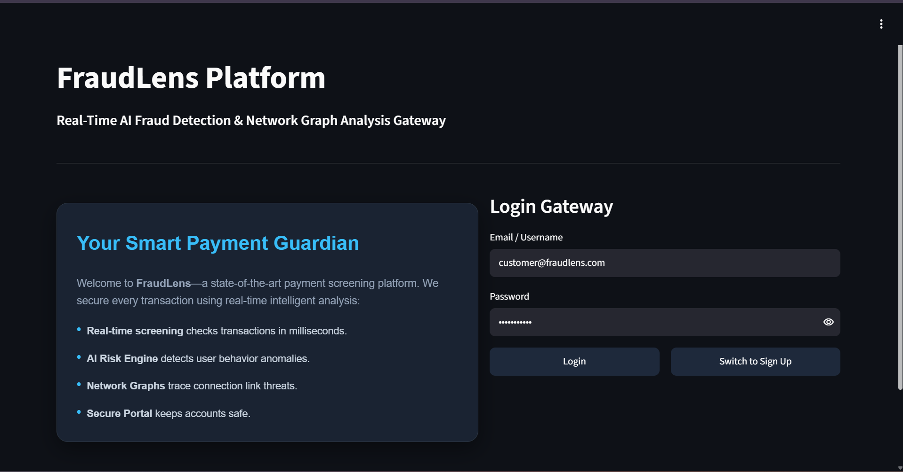
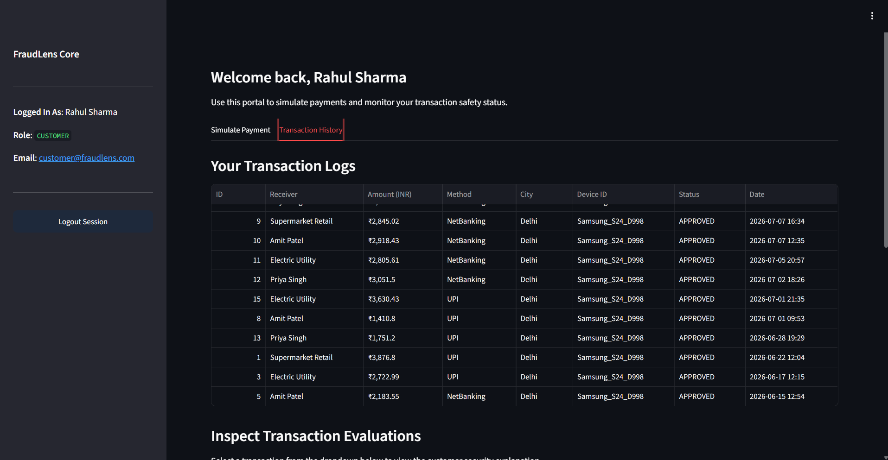
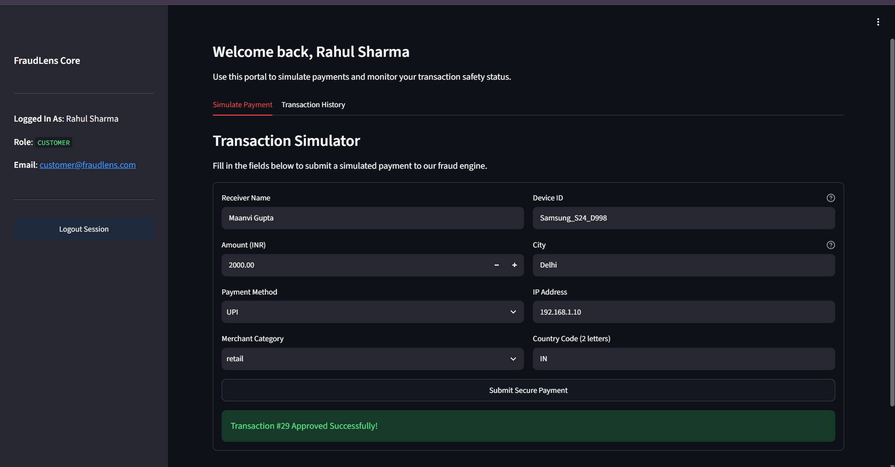
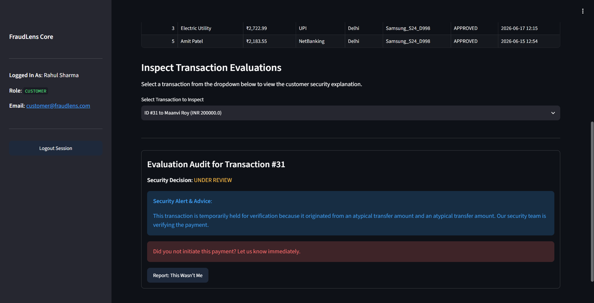
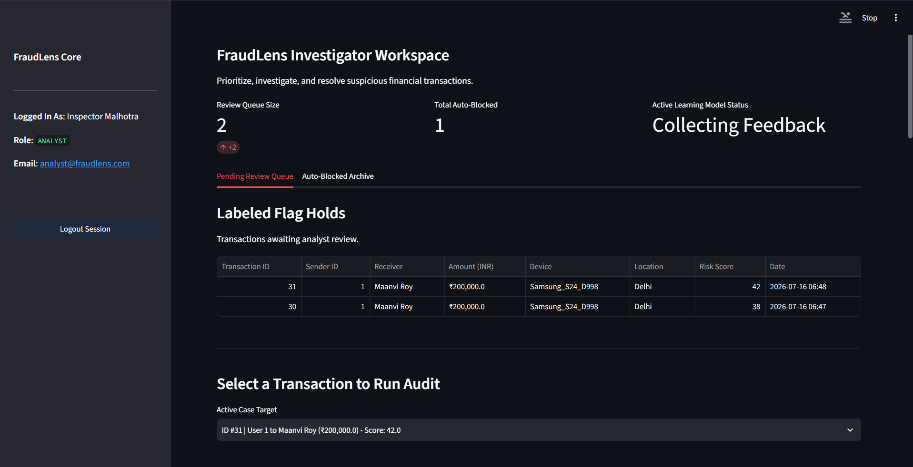
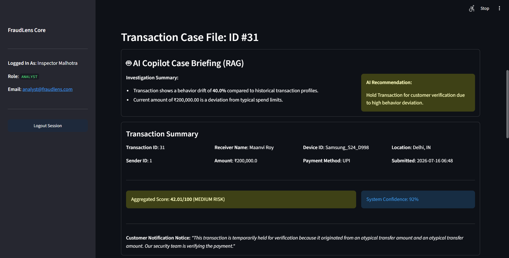
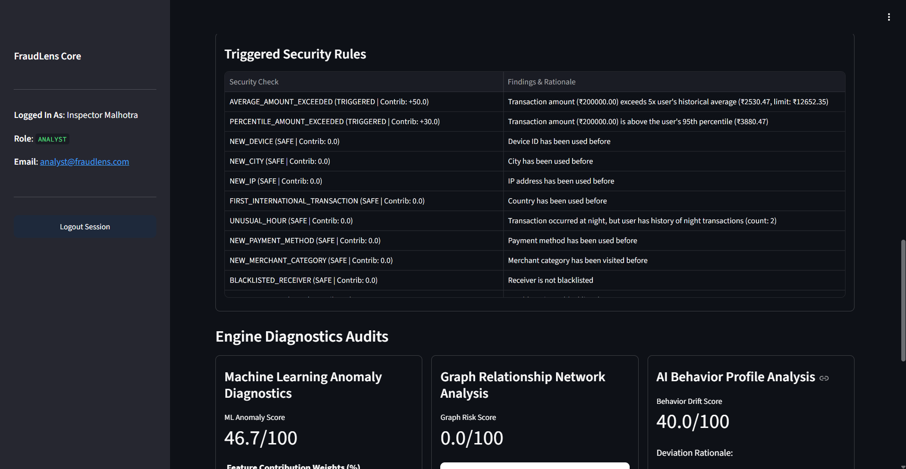
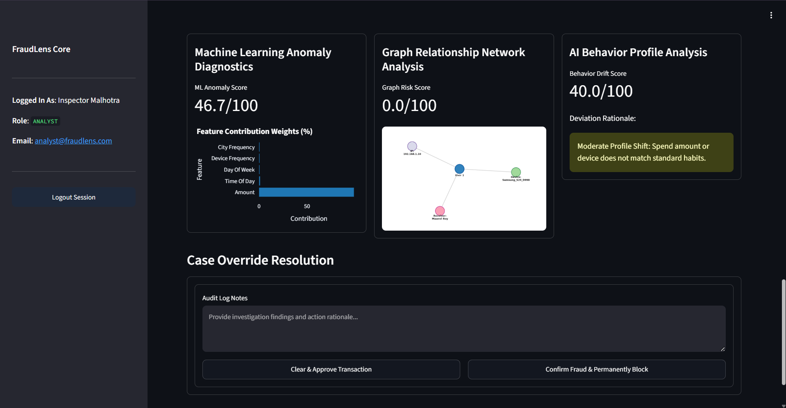

# FraudLens
### AI-Powered Payment Fraud Detection & Investigation Platform

FraudLens is an end-to-end fraud detection platform that combines **rule-based detection**, **hybrid machine learning anomaly detection**, **graph network analysis**, and **RAG-powered AI investigation assistance** to identify suspicious financial transactions in real time.

Designed as a production-inspired banking security system, FraudLens not only detects fraud but also provides explainable decisions for customers and investigators through dedicated dashboards.

---

# Features

## Multi-Layer Fraud Detection Pipeline

Every transaction passes through four independent detection engines before generating AI-driven analyst briefings:

```text
Transaction
      │
      ▼
Rule Engine
      │
      ▼
Behavior Drift Engine
      │
      ▼
Hybrid ML Anomaly Detection
(Isolation Forest + RF Active Learning)
      │
      ▼
Graph Relationship Analysis
(NetworkX Risk-by-Association)
      │
      ▼
Risk Aggregator
      │
      ▼
Decision
(APPROVE • REVIEW • BLOCK)
      │
      ▼
Gemini AI Explainer & RAG Copilot
```

---

## Rule Engine

Detects fraud using business rules such as:

- Large transaction amount anomalies (percentile and average exceedances)
- New device, IP address, and location/city detection
- First-time international transactions
- Impossible travel (velocity checking geographic distances)
- Shared device associations with blacklisted receivers
- High velocity limit triggers

---

## Behavior Drift Engine

Computes lifestyle deviation indices for incoming transactions:

- **Amount Drift:** Z-score validation of current payment against sender's historical average.
- **Contextual Drift:** Flags changes in transacting device, city, and merchant categories.
- Generates a composite **Behavior Drift Score (0.0 – 100.0)** mapping anomalies.

---

## Hybrid Machine Learning Engine

Combines unsupervised and supervised learning to balance cold-starts and human feedback:

- **Local Isolation Forest:** Unsupervised estimator fitted dynamically on user transaction history.
- **Supervised Random Forest (Active Learning):** Blends into the ML score dynamically based on model weights trained from analyst override logs.

---

## Graph Relationship Analysis

Builds a real-time transactional network using **NetworkX** to discover hidden fraud relationships:

- Maps nodes (Users, Devices, Receivers, IPs) and edges (`used_device`, `sent_money`, `connected_ip`).
- Computes path distances to known blacklisted entities and historically blocked accounts to detect fraud rings and risk-by-association.

---

## AI Investigation Assistant & RAG Copilot

Powered by **Google Gemini 2.5 Flash**

- **Customer Explanations:** Generates simple, reassuring, and clear descriptions explaining why a payment is pending or declined without revealing internal security thresholds.
- **RAG-based Investigator Briefings:** Automatically queries historical blocked cases sharing similar patterns (similar devices, IPs, or receivers) to build context, prompting Gemini to synthesize a structured investigation briefing and recommendation.

---

## Analyst Investigation Dashboard

Features include:

- **Pending Review Queue:** List of transactions flagged for manual review.
- **Auto-Blocked Archive:** Historic records of blocked transactions.
- **Rule Trigger Reports & ML Diagnostics:** Highlighting feature importance, z-scores, and rule contributions.
- **Gemini Copilot Hub:** Full markdown panel showing case summaries, recommendations, and matched historical precedents.
- **Active Learning Retraining Monitor:** Track training dataset sizes and model states.

---

## Customer Security Portal

Customers can:

- View transaction history
- Check real-time fraud status
- Read user-friendly AI explanations
- Verify flagged transactions

---

## Active Learning Pipeline

Analyst feedback is stored and used to continuously improve the machine learning classifier.

Workflow:

```text
Prediction
      │
      ▼
Analyst Decision
(Approve/Reject)
      │
      ▼
Store Feedback in Database
      │
      ▼
Automatic Retraining
(Random Forest)
      │
      ▼
Updated Hybrid ML Model
```

---

# Project Architecture

```text
                 Streamlit Frontend
              ┌────────────────────┐
              │ Customer Dashboard │
              │ Analyst Dashboard  │
              └──────────┬─────────┘
                         │
                  REST API Calls
                         │
              ┌──────────▼──────────┐
              │      FastAPI        │
              └──────────┬──────────┘
                         │
        |────────────────┼────────────────|────────────────|
        ▼                ▼                ▼                ▼
  Rule Engine    Behavior Drift     ML Engine      Graph Engine
        │                │                │                │
        |────────────────┼────────────────|────────────────|
                         ▼
                  Risk Aggregator
                         │
                         ▼
                Gemini AI Explainer
                         │
                         ▼
               SQLAlchemy / SQLite
```

---

# Project Structure

```text
FraudLens/
│
├── backend/
│   ├── app/
│   │   ├── api/              # API Routers & Endpoints
│   │   ├── core/             # Config, Security, and Exceptions
│   │   ├── database/         # Connection & Session Base
│   │   ├── models/           # SQLAlchemy Database Schemas
│   │   ├── schemas/          # Pydantic Validation Schemas
│   │   └── services/
│   │       └── fraud/        # Rules, Graph, Behavior & ML Engines
│   ├── tests/                # Automated PyTest Unit Tests
│   └── requirements.txt
│
├── frontend/
│   ├── components/           # Portals and Rendering Components
│   ├── utils/                # Client Utilities
│   ├── app.py                # Streamlit Entrypoint
│   └── requirements.txt
│
├── docker-compose.yml        # Container Configuration
├── README.md
└── LICENSE
```

---

# Tech Stack

## Backend

- FastAPI
- SQLAlchemy
- Alembic
- PostgreSQL / SQLite
- Pydantic

## Frontend

- Streamlit
- Plotly
- Pandas

## Machine Learning

- Scikit-learn (Isolation Forest & Random Forest)
- Joblib

## Graph Analytics

- NetworkX

## AI

- Google Gemini 2.5 Flash (Generative Language API)

## Testing

- PyTest

---

# Getting Started

## Clone Repository

```bash
git clone https://github.com/Divyabansal20/FraudLens.git
cd FraudLens
```

---

## Backend Setup

```bash
cd backend

python -m venv venv

# Windows
venv\Scripts\activate

# Linux/macOS
source venv/bin/activate

pip install -r requirements.txt
```

Create a `.env` file inside the **backend** directory:

```env
DATABASE_URL=sqlite:///./fraudlens.db
SECRET_KEY=your_secret_key
ALGORITHM=HS256
ACCESS_TOKEN_EXPIRE_MINUTES=30
GEMINI_API_KEY=your_api_key
```

Run the backend:

```bash
uvicorn app.main:app --reload
```

Access API Documentation:

```text
http://localhost:8000/docs
```

---

## Frontend Setup

```bash
cd frontend

python -m venv venv

# Windows
venv\Scripts\activate

# Linux/macOS
source venv/bin/activate

pip install -r requirements.txt

streamlit run app.py
```

Access the Streamlit Dashboard:

```text
http://localhost:8501
```

---

# Running Tests

To run the test suite for the risk engine and active learning loop:

```bash
cd backend

pytest
```

---
## Screenshots

### Login Page



---

### Customer Dashboard







---

### Analyst Dashboard








---

# Future Improvements

- Graph Neural Networks (GNNs) for advanced pattern classification
- Redis caching for super-low latency rule resolution
- Production-grade deployments utilizing Kubernetes
- Full microservice containerization
- CI/CD pipeline using GitHub Actions

---

# Author

**Divya Bansal**  
B.Tech Computer Science (Data Science)  
Bennett University

**GitHub:** https://github.com/Divyabansal20

**LinkedIn:** *www.linkedin.com/in/divya-bansal01*

---

# License

This project is licensed under the MIT License.
